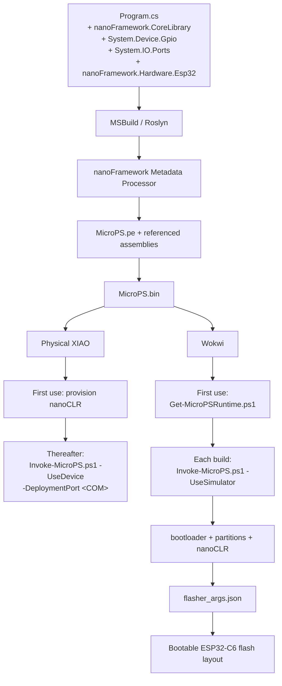
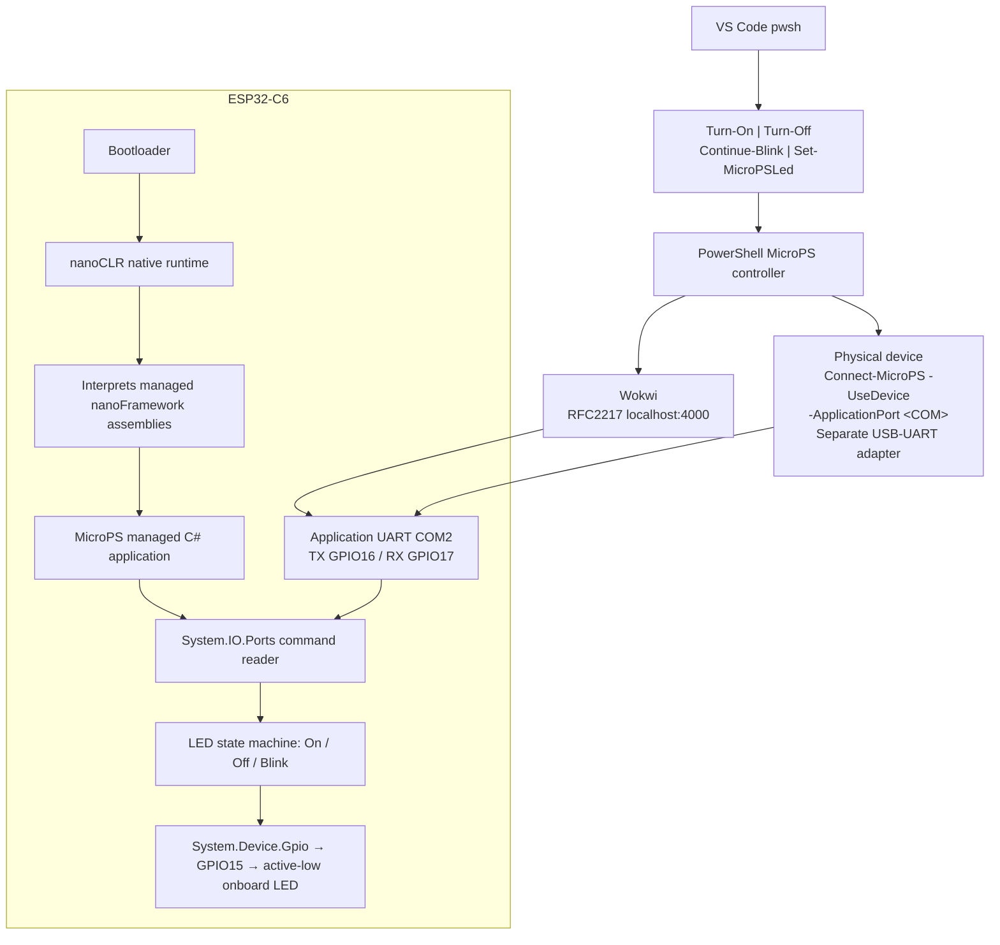
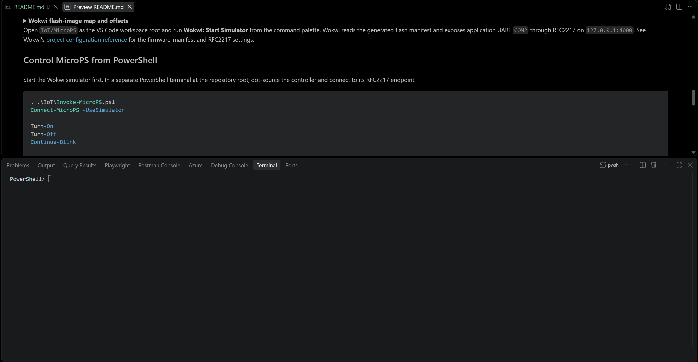

# MicroPS for the XIAO ESP32-C6

MicroPS is a .NET nanoFramework application for the Seeed Studio XIAO ESP32-C6. Managed C# firmware controls the
active-low onboard LED on GPIO15, while PowerShell provides the build, simulator, and command interface.

The firmware starts in a 500 ms blink mode and accepts `ON`, `OFF`, and `BLINK` over application UART `COM2`. It replies
with `OK ON`, `OK OFF`, `OK BLINK`, or `ERR UNKNOWN`.

The active build and deployment workflow uses nanoFramework tooling exclusively.

<details>
<summary><strong>Project files and generated-artifact policy</strong></summary>

## Files

- `MicroPS/MicroPS.sln` and `MicroPS/MicroPS/MicroPS.nfproj` define the classic nanoFramework MSBuild solution.
- `MicroPS/MicroPS/Program.cs` contains the managed GPIO, UART, command, and LED-state logic.
- `MicroPS/MicroPS/packages.config` pins the nanoFramework package dependencies.
- `MicroPS/wokwi.toml` and `MicroPS/diagram.json` configure the Wokwi simulator and application UART.
- `Invoke-MicroPS.ps1` packages Wokwi firmware or deploys the managed application to a provisioned physical device.
- `MicroPS.Controller.ps1` provides the PowerShell device-control functions and is loaded when `Invoke-MicroPS.ps1` is
  dot-sourced.
- `Get-MicroPSRuntime.ps1` downloads and verifies the pinned nanoCLR runtime when explicitly run by the user.

Restored NuGet packages, the nanoCLR runtime, and generated build artifacts are repository-local and ignored by Git.

</details>

## Prerequisites

- Visual Studio Build Tools with the Managed Desktop Build Tools workload and MSBuild.
- [.NET nanoFramework for VS Code](https://docs.nanoframework.net/content/getting-started-guides/getting-started-vs-code.html).
- [Wokwi for VS Code](https://docs.wokwi.com/vscode/getting-started).
- `nanoff` for managed application deployment on provisioned physical hardware.
- NuGet CLI for restoring the classic `packages.config` solution.

The project uses MSBuild and the nanoFramework metadata processor—not `dotnet build`. No project script installs or
updates software automatically.

## Confirm or install NuGet CLI

If NuGet CLI is not already available, run PowerShell as administrator to inspect and install it for all users:

```powershell
winget show --id Microsoft.NuGet --exact --source winget
winget install --id Microsoft.NuGet --exact --source winget --scope machine `
    --accept-source-agreements --accept-package-agreements
```

The package is published in Microsoft's
[official WinGet manifest repository](https://github.com/microsoft/winget-pkgs/tree/master/manifests/m/Microsoft/NuGet).

## Restore the managed packages and runtime

From the repository root, explicitly restore the pinned nanoFramework packages:

```powershell
nuget restore .\IoT\MicroPS\MicroPS.sln
```

Then explicitly acquire the native runtime used by Wokwi:

```powershell
.\IoT\Get-MicroPSRuntime.ps1
```

The acquisition script pins `ESP32_C6_THREAD` runtime version `1.17.0.285` and accepts the archive only when its SHA-256
is `096b533a8b6f22e59d3466545cd3b4a8d8b4cf24bd8249604380c6096e0f9b2f`.

Runtime acquisition is required for Wokwi packaging and supplies the files used for first-time physical provisioning.
`Get-MicroPSRuntime.ps1` downloads and validates those files; it does not flash or otherwise modify a connected device.

## Build and start Wokwi

Build the managed application and compose Wokwi's flash manifest:

```powershell
.\IoT\Invoke-MicroPS.ps1 -UseSimulator -Verbose
```

The command uses MSBuild to produce the nanoFramework application, validates its deployment size, and creates the
ignored `MicroPS/build/wokwi/flasher_args.json`. The manifest maps the flash images as follows:

<details>
<summary><strong>Wokwi flash-image map and offsets</strong></summary>

| Address | Image | Purpose |
| ---: | --- | --- |
| `0x0` | `bootloader.bin` | ESP32-C6 bootloader |
| `0x8000` | `partitions_4mb.bin` | 4 MB flash partition table |
| `0x10000` | `nanoCLR.bin` | Native nanoFramework runtime |
| `0x250000` | `MicroPS.bin` | Managed application deployment image |

</details>

Open `IoT/MicroPS` as the VS Code workspace root and run **Wokwi: Start Simulator** from the command palette. Wokwi reads
the generated flash manifest and exposes application UART `COM2` through RFC2217 on `127.0.0.1:4000`. See Wokwi's
[project configuration reference](https://docs.wokwi.com/vscode/project-config) for the firmware-manifest and RFC2217
settings.

## Control MicroPS from PowerShell

Start the Wokwi simulator first. In a separate PowerShell terminal at the repository root, dot-source the controller and
connect to its RFC2217 endpoint:

```pwsh
. .\IoT\Invoke-MicroPS.ps1
Connect-MicroPS -UseSimulator

Turn-On
Turn-Off
Continue-Blink

Set-MicroPSLed -State On
Set-MicroPSLed -State Off
Set-MicroPSLed -State Blink

Disconnect-MicroPS
```

`Set-MicroPSLed` is the canonical PowerShell command. `Turn-On`, `Turn-Off`, and `Continue-Blink` are intentionally named
convenience wrappers. The controller implements the small Telnet/RFC2217 negotiation needed by Wokwi using .NET sockets;
it does not require PySerial or another client package.

<details>
<summary><strong>Build, deployment, and runtime architecture</strong></summary>

## Architecture

### Build and deployment



The managed application is packaged separately from the native runtime. A blank or incompatible physical device first
requires the pinned nanoCLR runtime to be provisioned over its deployment port. Thereafter, `-UseDevice` builds and
deploys only the managed application. Wokwi instead boots the precomposed flash layout described by `flasher_args.json`.
This follows nanoFramework's
[deployment model](https://docs.nanoframework.net/content/architecture/deployment.html).

### Runtime and interaction



The application UART is separate from nanoFramework's deployment and debugging transport, preventing PowerShell text
commands from colliding with the nanoFramework wire protocol.

</details>

<details>
<summary><strong>MicroPS Wokwi simulation</strong></summary>

## Wokwi for VS Code



</details>

## Memory and artifact sizes

Flash image size, native static SRAM, and managed heap are different measurements and must not be added together:

<details>
<summary><strong>MicroPS nanoFramework measurements and exact build context</strong></summary>

### MicroPS nanoFramework measurements

| Measurement | How it is obtained | Current status |
| --- | --- | --- |
| Native nanoCLR static SRAM | Requires its exact native linker map. | Unknown: the prebuilt archive omits the map. |
| Free managed heap | Printed from `GC.Run(true)` after `MICROPS READY`. | Record after a verified Wokwi boot. |
| `nanoCLR.bin` size | File length of the pinned native runtime image. | **2,128,224 bytes** of flash, not SRAM. |
| `MicroPS.bin` size | File length of the generated managed deployment image. | **75,892 bytes** of flash, not SRAM. |

The flash sizes above were observed on 2026-08-21 after the first restored and built configuration. Their exact context is:

- Runtime target `ESP32_C6_THREAD` version `1.17.0.285`; archive SHA-256
  `096b533a8b6f22e59d3466545cd3b4a8d8b4cf24bd8249604380c6096e0f9b2f`; `nanoCLR.bin` SHA-256
  `3667ba406942a32741fb64e20e6da3c1d6cb4a20c39116835f50a6378a8083e0`.
- Packages: CoreLibrary `1.17.11`, Hardware.Esp32 `1.6.42`, Runtime.Events `1.11.39`, Runtime.Native `1.7.11`,
  System.Device.Gpio `1.1.64`, System.IO.Ports `1.1.142`, System.IO.Streams `1.1.96`, and System.Text `1.3.42`.
- MSBuild `18.9.1.35102` and nanoFramework VS Code extension `1.0.247`.
- `MicroPS.bin` SHA-256 `6d9b3f279eac327851a3d793c68e22296c6cbe0755226d115a0bfcb13190eaa9`; it contains nine
  nanoFramework `.pe` files totaling exactly 75,892 bytes.

All seven native-backed managed assemblies match the versions and checksums in this runtime's `native_assemblies.csv`;
System.IO.Streams has no native-assembly requirement. Wokwi boot remains the live compatibility check.

</details>

`GC.Run(true)` reports available managed heap after garbage collection; it is not total ESP32-C6 SRAM. Likewise, the
lengths of `nanoCLR.bin` and `MicroPS.bin` describe flash artifacts rather than their runtime SRAM footprints.

## Physical deployment

Physical hardware was not connected, flashed, or used to validate this workflow. The commands below document the
intended interface; the XIAO ESP32-C6 runtime compatibility and actual Windows COM-port assignments remain hardware
verification items.

<details>
<summary><strong>Physical provisioning, deployment, wiring, and control procedure</strong></summary>

Before the first managed deployment, provision the pinned `ESP32_C6_THREAD` nanoCLR runtime through the board's
deployment port. This is a first-time or runtime-upgrade operation, not the normal application command channel. Once a
compatible nanoCLR is running, build and deploy `MicroPS.bin` through the nanoFramework Wire Protocol:

```powershell
.\IoT\Invoke-MicroPS.ps1 -UseDevice -DeploymentPort 'COM4' -Verbose
```

The command uses `nanoff --nanodevice --deploy`; it does not update nanoCLR. To exercise the build and target selection
without contacting a device, add `-WhatIf`. This is hardware-safe but still refreshes local MSBuild output files.

Keep the onboard USB connection for nanoFramework deployment and debugging. Use a separate 3.3 V USB-UART adapter for
the MicroPS command channel:

| USB-UART adapter | XIAO ESP32-C6 |
| --- | --- |
| RX | D6 / GPIO16 / application `COM2` TX |
| TX | D7 / GPIO17 / application `COM2` RX |
| GND | GND |

After the physical firmware is deployed and the adapter appears as a Windows COM port, control it from PowerShell:

```powershell
. .\IoT\Invoke-MicroPS.ps1
Connect-MicroPS -UseDevice -ApplicationPort 'COM5'
Turn-On
Continue-Blink
Disconnect-MicroPS
```

`COM4` is an example nanoFramework deployment/Wire Protocol port. `COM5` is an example port for the separate 3.3 V
USB-UART adapter connected to application `COM2` on GPIO16/17. They are different transports and are not interchangeable.

</details>

Do not connect a 5 V UART signal to the XIAO's 3.3 V GPIO pins.
